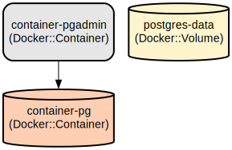

# 🚀 PostgreSQL and PgAdmin Docker/Podman Development Environment 🚀

This project provides a containerized development environment that runs PostgreSQL database and PgAdmin web interface using either Docker or Podman. It simplifies database management and development by containerizing both services with pre-configured settings and persistent storage.

The environment consists of two main components: a PostgreSQL database server and PgAdmin web interface, both running in separate containers. This setup enables developers to quickly spin up a local database environment with a graphical management interface. The configuration includes persistent storage for the database data, making it suitable for development and testing purposes.

## Repository Structure
```
.
├── db-scripts/               # Database initialization scripts
│   └── create-tables.sql     # SQL script for creating database tables
└── docker-compose.yaml       # Docker/Podman Compose configuration for PostgreSQL and PgAdmin
```

## Usage Instructions
### Prerequisites
- Docker Engine 19.03.0+ OR Podman 3.0.0+
- Docker Compose 1.27.0+ OR Podman Compose
- At least 2GB of free disk space
- Open ports 5432 and 5050 on your host machine

### Installation

#### Option 1: Using Docker

1. Clone the repository:
```bash
git clone <repository-url>
cd <repository-name>
```

2. Start the containers:
```bash
docker-compose -f docker-compose.yaml up -d
```

#### Option 2: Using Podman

1. Install Podman:

**For Ubuntu/Debian:**
```bash
sudo apt-get update
sudo apt-get install -y podman
```

**For RHEL/CentOS/Fedora:**
```bash
sudo dnf install -y podman
```

**For macOS:**
```bash
brew install podman
podman machine init
podman machine start
```

**For Windows:**
```bash
winget install RedHat.Podman
```

2. Install Podman Compose:
```bash
pip3 install podman-compose
```

3. Clone the repository and start containers:
```bash
git clone <repository-url>
cd <repository-name>
podman-compose up -d
```

### Quick Start

1. Access PostgreSQL database:
```bash
# Using Docker
docker exec -it container-pg psql -U admin -d test_db

# Using Podman
podman exec -it container-pg psql -U admin -d test_db
```

2. Access PgAdmin:
- Open your web browser and navigate to `http://localhost:5050`
- Login credentials:
  - Email: admin@admin.com
  - Password: root

3. Connect to PostgreSQL server in PgAdmin:
- Host: postgres
- Port: 5432
- Username: admin
- Password: root
- Database: test_db

### More Detailed Examples

#### Connecting to PostgreSQL using different clients:

**Using DBeaver:**
```
Connection Settings:
Host: localhost
Port: 5432
Database: test_db
Username: admin
Password: root
```

**Using Python with psycopg2:**
```python
import psycopg2

conn = psycopg2.connect(
    dbname="test_db",
    user="admin",
    password="root",
    host="localhost",
    port="5432"
)
```

### Troubleshooting

#### Container Start-up Issues
1. Port conflicts:
```bash
# Check if ports are already in use
sudo lsof -i :5432
sudo lsof -i :5050

# Docker alternative ports configuration
docker-compose -f docker-compose.yaml down
# Edit ports in docker-compose.yaml
docker-compose -f docker-compose.yaml up -d

# Podman alternative ports configuration
podman-compose down
# Edit ports in docker-compose.yaml
podman-compose up -d
```

2. Permission issues with volumes:
```bash
# Docker volume management
docker volume inspect postgres-data
docker-compose down -v
docker-compose up -d

# Podman volume management
podman volume inspect postgres-data
podman-compose down -v
podman-compose up -d
```

#### Database Connection Issues
- Verify container status:
```bash
# Docker commands
docker ps | grep container-pg
docker logs container-pg

# Podman commands
podman ps | grep container-pg
podman logs container-pg
```

- Check network connectivity:
```bash
# Docker network inspection
docker network ls
docker network inspect $(docker network ls | grep postgres | awk '{print $1}')

# Podman network inspection
podman network ls
podman network inspect $(podman network ls | grep postgres | awk '{print $1}')
```

## Data Flow
The environment enables data flow between client applications, PgAdmin interface, and the PostgreSQL database server. Client applications connect to PostgreSQL directly while administrative tasks are handled through PgAdmin.

```ascii
Client Apps       PgAdmin Web UI
     ↓                ↓
     └────────┐ ┌────┘
              ↓ ↓
         PostgreSQL
           ↓
    Persistent Storage
```

Key component interactions:
1. PostgreSQL server listens on port 5432 for client connections
2. PgAdmin web interface is accessible on port 5050
3. Both services use container internal network for communication
4. PostgreSQL data is persisted using named volume 'postgres-data'
5. Client applications connect using provided credentials
6. PgAdmin manages database through PostgreSQL's standard port

## Infrastructure



### Container Resources
- **PostgreSQL Container**
  - Type: Container
  - Name: container-pg
  - Image: postgres:latest
  - Exposed Port: 5432
  - Volume: postgres-data:/var/lib/postgresql/data

- **PgAdmin Container**
  - Type: Container
  - Name: container-pgadmin
  - Image: dpage/pgadmin4
  - Exposed Port: 5050
  - Dependencies: postgres container

- **Volumes**
  - Name: postgres-data
  - Type: Named volume
  - Purpose: Persistent storage for PostgreSQL data