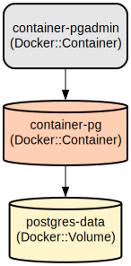

# 🚀 PostgreSQL and PgAdmin Docker Development Environment 🚀

This project provides a Docker-based development environment that runs PostgreSQL database and PgAdmin web interface. It simplifies database management and development by containerizing both services with pre-configured settings and persistent storage.

The environment consists of two main components: a PostgreSQL database server and PgAdmin web interface, both running in separate containers. This setup enables developers to quickly spin up a local database environment with a graphical management interface. The configuration includes persistent storage for the database data, making it suitable for development and testing purposes.

## Repository Structure
```
.
├── db-scripts/               # Database initialization scripts
│   └── create-tables.sql     # SQL script for creating database tables
└── postgres-container-run.yaml  # Docker Compose configuration for PostgreSQL and PgAdmin
```

## Usage Instructions
### Prerequisites
- Docker Engine 19.03.0+
- Docker Compose 1.27.0+
- At least 2GB of free disk space
- Open ports 5432 and 5050 on your host machine

### Installation

1. Clone the repository:
```bash
git clone <repository-url>
cd <repository-name>
```

2. Start the containers:
```bash
docker-compose -f postgres-container-run.yaml up -d
```

### Quick Start

1. Access PostgreSQL database:
```bash
# Connect using psql client
psql -h localhost -p 5432 -U admin -d test_db
```

2. Access PgAdmin:
- Open your web browser and navigate to `http://localhost:5050`
- Login credentials:
  - Email: admin@admin.com
  - Password: root

3. Connect to PostgreSQL server in PgAdmin:
- Host: postgres
- Port: 5432
- Username: admin
- Password: root
- Database: test_db

### More Detailed Examples

#### Connecting to PostgreSQL using different clients:

**Using DBeaver:**
```
Connection Settings:
Host: localhost
Port: 5432
Database: test_db
Username: admin
Password: root
```

**Using Python with psycopg2:**
```python
import psycopg2

conn = psycopg2.connect(
    dbname="test_db",
    user="admin",
    password="root",
    host="localhost",
    port="5432"
)
```

### Troubleshooting

#### Container Start-up Issues
1. Port conflicts:
```bash
# Check if ports are already in use
sudo lsof -i :5432
sudo lsof -i :5050

# Alternative ports can be configured in postgres-container-run.yaml
```

2. Permission issues with volumes:
```bash
# Check volume permissions
docker volume inspect postgres-data

# Reset volume if needed
docker-compose -f postgres-container-run.yaml down -v
docker-compose -f postgres-container-run.yaml up -d
```

#### Database Connection Issues
- Verify container status:
```bash
docker ps | grep container-pg
docker logs container-pg
```

- Check network connectivity:
```bash
docker network ls
docker network inspect $(docker network ls | grep postgres | awk '{print $1}')
```

## Data Flow
The environment enables data flow between client applications, PgAdmin interface, and the PostgreSQL database server. Client applications connect to PostgreSQL directly while administrative tasks are handled through PgAdmin.

```ascii
Client Apps       PgAdmin Web UI
     ↓                ↓
     └────────┐ ┌────┘
              ↓ ↓
         PostgreSQL
           ↓
    Persistent Storage
```

Key component interactions:
1. PostgreSQL server listens on port 5432 for client connections
2. PgAdmin web interface is accessible on port 5050
3. Both services use Docker's internal network for communication
4. PostgreSQL data is persisted using named volume 'postgres-data'
5. Client applications connect using provided credentials
6. PgAdmin manages database through PostgreSQL's standard port

## Infrastructure



### Docker Resources
- **PostgreSQL Container**
  - Type: Docker container
  - Name: container-pg
  - Image: postgres:latest
  - Exposed Port: 5432
  - Volume: postgres-data:/var/lib/postgresql/data

- **PgAdmin Container**
  - Type: Docker container
  - Name: container-pgadmin
  - Image: dpage/pgadmin4
  - Exposed Port: 5050
  - Dependencies: postgres container

- **Volumes**
  - Name: postgres-data
  - Type: Named volume
  - Purpose: Persistent storage for PostgreSQL data